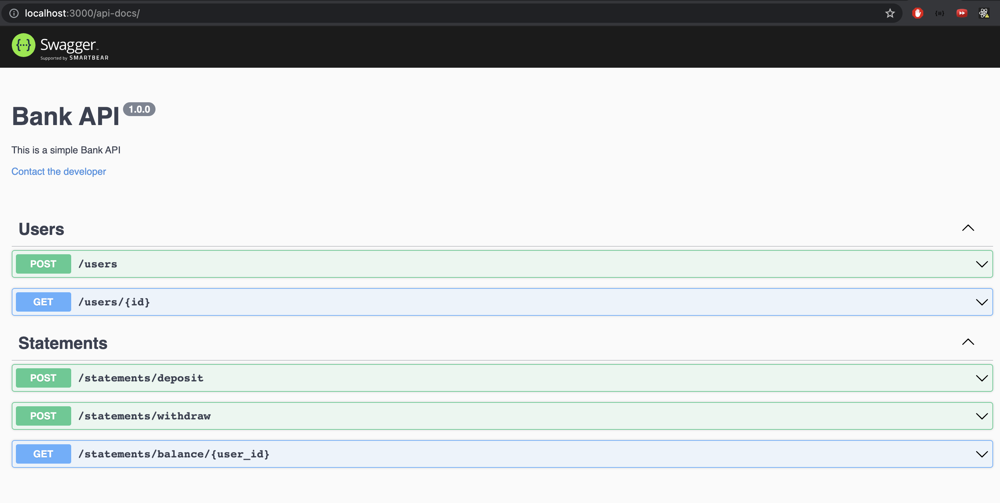

## Bank API

Simple example of a bank API

---
### Main technologies:
- Node.js (https://nodejs.org/en/)
- TypeScript (https://www.typescriptlang.org/docs/)
- Express.js (http://expressjs.com/)
- TSyringe (https://www.npmjs.com/package/tsyringe)
- BCrypt.js (https://www.npmjs.com/package/bcryptjs)
- Docker (https://docs.docker.com/)
- TypeORM (https://typeorm.io/#/)
- PostgreSQL (https://www.postgresql.org/)
- Class-transformer (https://www.npmjs.com/package/class-transformer)
- Jest (https://jestjs.io/)
- Swagger (https://swagger.io/)

---
### How to run this project:

### 1. Clone this repository
```
$ git clone https://github.com/jhonnydelima/bank-api
```

### 2. Running the application on your terminal
```
#install the dependencies
$ yarn

#start the server
$ yarn dev
```

### 3. Running the unit tests
```
#type in the terminal
$ yarn test
```

---
### Swagger Documentation



Check the swagger documentation locally in: http://localhost:3000/api-docs

---
### 📄 License
This project is under MIT license. See the [LICENSE](https://github.com/jhonnydelima/bank-api/blob/main/LICENSE) file for more details.